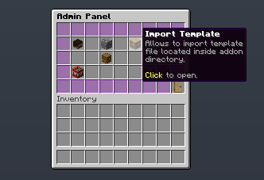
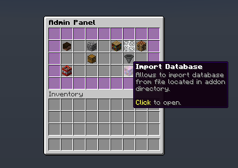
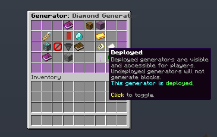

# MagicCobblestoneGenerator

**MagicCobblestoneGenerator** turns the plain and boring cobblestone generators to an awesome and reliable source of configurable blocks!

Created and maintained by [BONNe](https://github.com/BONNe).

{{ addon_description("MagicCobblestoneGenerator") }}

## Installation

1. Place the addon jar in the addons folder of the BentoBox plugin
2. Restart the server
3. Run the `/[admincmd] generator` command to configure the addon

## Configuration

By default, the addon tries to import all data from template file, to simplify first setup. A lot of addon settings are exposed in Admin GUI, however, some of them are not.
The latest config options, and their detailed explanations can be found [here](https://github.com/BentoBoxWorld/MagicCobblestoneGenerator/blob/develop/src/main/resources/config.yml).

Template file are mostly for users who do not like to use ingame editing GUI. However, template file is not automatically imported on each change. It requires importing via command or Admin GUI.

??? question "Template File Structure"
    ```
    # Start the listing of all generator tiers.
    tiers:
      # Unique Id for generator. Used in internal storage and accessing to each generator data.
      generator_unique_id: 
        # Display name for users. Supports colour codes.
        # Default value: generator_unique_id without _
        name: "Something fancy"
        # Description in lore message. Supports colour codes.
        # Can be defined empty by replacing eveything with [].
        # Default value: []
        description: -|
          First Line Of lore Message
          &2Second Line Of lore Message
        # Icon used in GUI's. Number at the end allows to specify stack size for item.
        # Default value: Paper.
        icon: "PAPER:1"
        # Generator type: COBBLESTONE, STONE or BASALT. Self explanatory.
        # Default value: COBBLESTONE
        type: COBBLESTONE
        # Indicates if genertor is default generator. Default generators ignores requirement section.
        # It is activated for each new island. Can be only one per each generator type.
        # Default value: false
        default: false
        # Users selects active generators.
        # Priority indicates which generator will be used
        # if multiple of them fulfills requirements.
        # Default value: 1
        priority: 1
        # There are several requirements that can be defined here.
        requirements:
          # Can define minimal island level for generator to work. Required Level Addon.
          # Default value: 0
          island-level: 10
          # List of required permissions for users to select this generator.
          # Default value: []
          required-permissions: []
          # List of required biomes for generator to work.
          # Empty means that there is no limitation in which biome generator works.
          # Default value: [].
          required-biomes: []
          # Cost for purchasing this generator. Requires Vault and any economy plugin.
          # Currently implemented by clicking on purchase icon in generator view GUI.
          # Default value: 0
          purchase-cost: 5.0
        # Cost for activating current generator tier. Requires Vault and any economy plugin.
        # Will be payed only on active switching between generators.
        # Default value: 0.
        activation-cost: 0.0
        # Materials and their chances. Use actual blocks please.
        # Chance supports any positive number, including double value.
        # Everything in the end will be normalized.
        # Default value: []
        blocks:
          FIRST_BLOCK_NAME_ID: NUMBER
          SECOND_BLOCK_NAME_ID: NUMBER
        # Treasure that has a chance to be dropped when block is generated.
        # ONLY on generation, not on block break.
        # Default value: []
        treasure:
          # Chance from 0 till 1. 0 - will not be possible to get a treasure.
          # Default value: 0
          chance: 0.001
          # Materials that can be dropped. Applies to the same rules as block section.
          # Default value: []
          material:
            FIRST_BLOCK_NAME_ID: NUMBER
            SECOND_BLOCK_NAME_ID: NUMBER
          # Maximal amount of items dropped.
          # It will be from 1 till defined amount.
          # Default value: 1
          amount: 1
    
    # Start the listing of all bundles
    bundles:
      # bundle_id
      bundle_unique_id:
        # Display name for users
        name: "Something fancy"
        # Description in lore message. Supports colour codes.
        # Can be defined empty by replacing eveything with [].
        # Default value: []
        description: -|
          First Line Of lore Message
          &2Second Line Of lore Message
        # Icon used in GUI's. Number at the end allows to specify stack size for item.
        # Default value: Paper.
        icon: "PAPER:1"
        # List of generators that bundle will work have access.
        generators:
          - generator_id_1
          - generator_id_2
    ```

## Commands

!!! tip
    `[player_command]` and `[admin_command]` are commands that differ depending on the gamemode you are running.
    The Gamemodes' `config.yml` file contains options that allows you to modify these values.
    As an example, on BSkyBlock, the default `[player_command]` is `island`, and the default `[admin_command]` is `bsbadmin`.
    Be aware, that this addon allows changing player commands aliases in addon `config.yml` file. 

=== "Player commands"
    - `/[player_command] generator`: Access to generator Selection GUI. 
    - `/[player_command] generator view <generator>`: Access to specific generator detailed view. 
    - `/[player_command] generator activate <generator> [false]`: Allows to activate (or deactivate) specific generator.
    - `/[player_command] generator buy <generator>`: Allows to buy specific generator.

=== "Admin commands"
    - `/[admin_command] generator`: Access to addon Admin GUI
    - `/[admin_command] generator import`: Imports default template file - `/plugins/BentoBox/addons/MagicCobblestoneGenerator/generatorTemplate.yml`.
    - `/[admin_command] generator database import <file>`: Ability to import database exported <file>.
    - `/[admin_command] generator database export <file>`: Ability to export database into <file> saved in `/plugins/BentoBox/addons/MagicCobblestoneGenerator/` folder.
    - `/[admin_command] generator why <player>`: A debugging command that allows finding issues with generators for each player.

## Permissions

!!! tip
    `[gamemode]` is a prefix that differs depending on the gamemode you are running.
    The prefix is the lowercased name of the gamemode, i.e. if you are using BSkyBlock, the prefix is `bskyblock`.
    Similarly, if you are using AcidIsland, the prefix is `acidisland`.

=== "Player permissions"
    - `[gamemode].stone-generator` - Let the player use the '/[player_command] generator' command and its subcommands.
    - `[gamemode].admin.stone-generator` - Let the player use the '/[admin_command] generator' command and its subcommands.
    - `[gamemode].admin.stone-generator.why` - Let the player use a debug command '/[admin_command] why generator <player>'.
    - `[gamemode].admin.stone-generator.database` - Let the player use the '/[admin_command] generator database' command and its subcommands.

=== "Admin permissions"
    - `[gamemode].admin.stone-generator` - Let the player use the '/[admin_command] generator' command and its subcommands.
    - `[gamemode].admin.stone-generator.why` - Let the player use a debug command '/[admin_command] why generator <player>'.
    - `[gamemode].admin.stone-generator.database` - Let the player use the '/[admin_command] generator database' command and its subcommands.
    
??? question "Something is missing?"
    You can find the comprehensive list of permissions in the [addon.yml](https://github.com/BentoBoxWorld/MagicCobblestoneGenerator/blob/develop/src/main/resources/addon.yml) file of this addon.  
    If something is indeed missing from the list below, please let us know!
   

## Placeholders
Please read the main [Placeholders page](/en/latest/BentoBox/Placeholders).

| Placeholder | Description | Version |
|-------------------------------------------------------|--------------------------------------------------------------------------------|-----------|
| `%[gamemode]_magiccobblestonegenerator_active_generator_count` | Returns number of currently active generator tiers | 2.2.0 |
| `%[gamemode]_magiccobblestonegenerator_max_active_generator_count` | Returns number of maximal amount of active generator tiers | 2.2.0 |
| `%[gamemode]_magiccobblestonegenerator_active_generator_names` | Returns text that contains all active generator names separated with `,` | 2.2.0 |
| `%[gamemode]_magiccobblestonegenerator_unlocked_generator_names` | Returns text that contains all unlocked generator names separated with `,` | 2.2.0 |
| `%[gamemode]_magiccobblestonegenerator_purchased_generator_names` | Returns text that contains all purchased generator names separated with `,` | 2.2.0 |


## FAQ

??? question "Can you add a feature X?"
    Please add it to the list [here](https://github.com/BentoBoxWorld/MagicCobblestoneGenerator/issues).

??? question "How can I add a new generator tier?"
    Currently, addon supports 3 ways how to add a new generator:
    
    - By using ingame GUI that is available via `/[admin] generator` command.
    - By adding generator to a template file. 
    - By adding generator to the exported database file.

??? question "I added generator to the template/database file, but it does not shows up in game."
    For easier configuration with multiple gamemodes, generators are stored in the internal database. After editing template or database file, you need to import them into that memory. You can do it via Admin GUI by clicking on `Import Template` or `Import Database` buttons.
    
    {: loading=lazy }
    {: loading=lazy }

??? question "I have a generator that shows up in Admin GUI, but players do not see it."
    Most likely it is because of "deployment" status. To avoid with issues when players starts to activate generators while an admin is adding them, generators are undeployed and noone can use them. You can activate them by editing generator via Admin GUI and clicking on lever in Edit Generator GUI.
    {: loading=lazy }

??? question "What is treasures?"
    Treasures are things that are dropped uppon block generation. It allows to give an extra customization for each generator.

??? question "What is bundles?"
    Bundles is a feature that allows customizing experience for each island even more. If bundle is assigned to an island, then players on that island will be able to use only generators from that bundle. 

??? question "Can I disable showing required permissions in generator description?"
    Yes, addon provides a lot of customization options for displaying each generator. It is located in locales file:
    ```
          # Generator lore message generator. All elements in generator lore is generated
          # based on section below.
          generator:
            # Main lore element content. If you do not want to display treasures at all,
            # just remove them from [treasures] section.
            # [description] comes from each generator tier.
            # Lore does not supports colour codes. Each object separate supports.
            lore: |-
              [description]
              [blocks]
              [treasures]
              [type]
              [requirements]
              [status]
            # Generates [blocks] section
            blocks:
              # First line in blocks section. Empty line will not be displayed.
              title: "&7&l Blocks:"
              # Each block and its value under title. Cannot be empty.
              # Supports [number], [#.#], [#.##], [#.###], [#.####], [#.#####]
              value: "&8 [material] - [#.##]%"
            # Generates [treasures] section
            treasures:
              # First line in blocks section. Empty line will not be displayed.
              title: "&7&l Treasures:"
              # Each treasure and its value under title. Cannot be empty.
              # Supports [number], [#.#], [#.##], [#.###], [#.####], [#.#####]
              value: "&8 [material] - [#.####]%"
            # Generates [requirements] section
            requirements:
              # Allows to change order and content of requirements message.
              description: |-
                [biomes]
                [level]
                [missing-permissions]
              # Generates [level] message.
              level: "&c&l Required Level: &r&c [number]"
              # Generates [missing-permission] message title.
              permission-title: "&c&l Missing Permissions:"
              # Generates [missing-permission] message values.
              permission: "&c  -[permission]"
              # Generates [biomes] message title.
              biome-title: "&7&l Operates in:"
              # Generates [biomes] message values.
              biome: "&8 [biome]"
              # Generates [biomes] message for All Biomes.
              any: "&7&l Operates in &e&o all &r&7&l biomes"
            # Generates [status] section
            status:
              # Message that is showed for Locked generators.
              locked: "&c Locked!"
              # Message that is showed for generators that is not deployed.
              undeployed: "&c Not Deployed!"
              # Message that is showed for Active generators.
              active: "&2 Active"
              # Message that is showed for generators that required purchasing.
              purchase-cost: "&e Purchase Cost: $[number]"
              # Message that is showed for generators that has activation cost.
              activation-cost: "&e Activation Cost: $[number]"
            # Generates [type] section
            type:
              title: "&7&l Supports:"
              cobblestone: "&8 Cobblestone Generators"
              stone: "&8 Stone Generators"
              basalt: "&8 Basalt Generators"
              any: "&7&l Supports &e&o all &r&7&l generators"
    ```

## Translations

{{ translations(2972, ["de", "es", "lv"]) }}
